# Fixed-Step Simulation Loop (V3)

```mermaid
graph TD
	Update(Frame) -->|Δt| Accumulator
	Accumulator -->|≥ dt ?| SimulationStep{EmitSimulationStep}
	SimulationStep -->|1..N per frame| Logic[Deterministic systems]
	Update -->|α = accum / dt| Render
```



```

* **Determinism** - logic only runs on discrete ticks.  
* **Visual smoothness** via α-based interpolation.  
* **Spiral-of-death guard** drops work if > `max_steps_per_frame`.  

Add systems to `FixedUpdate` when they must lock-step with simulation.
```

---

## How to merge

1. Copy the new files, apply the small plugin tweaks.
2. `cargo test` → all green.
3. Mark the five Kanban cards  **Done** . 🎉

Let me know if you'd like  **deeper code-review** , different key-bindings, or want to automate doc-snippet generation.
