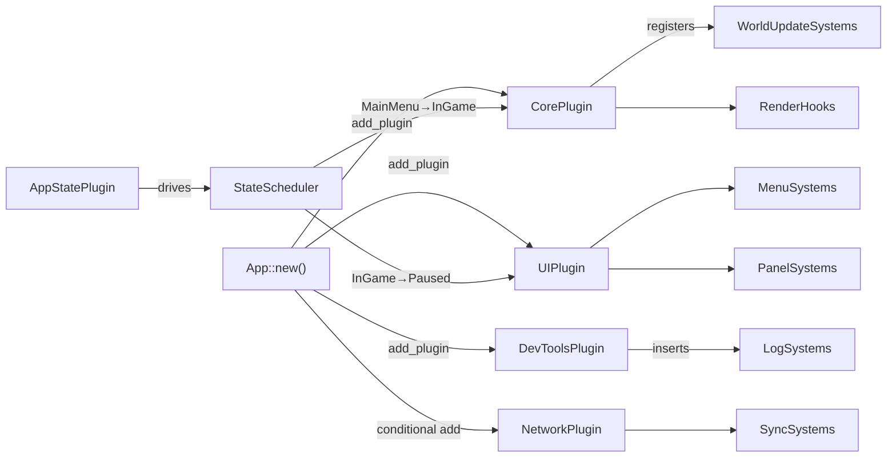

```mermaid
flowchart LR
  MainApp["App::new()"] -->|add_plugin| DevToolsPlugin
  MainApp -->|add_plugin| CorePlugin
  MainApp -->|add_plugin| UIPlugin
  MainApp -->|conditional add| NetworkPlugin
  DevToolsPlugin -->|inserts| LogSystems
  CorePlugin -->|registers| WorldUpdateSystems
  CorePlugin --> RenderHooks
  UIPlugin --> MenuSystems
  UIPlugin --> PanelSystems
  NetworkPlugin --> SyncSystems
  AppState["AppStatePlugin"] -->|drives| StateScheduler
  StateScheduler -->|MainMenu→InGame| CorePlugin
  StateScheduler -->|InGame→Paused| UIPlugin
```