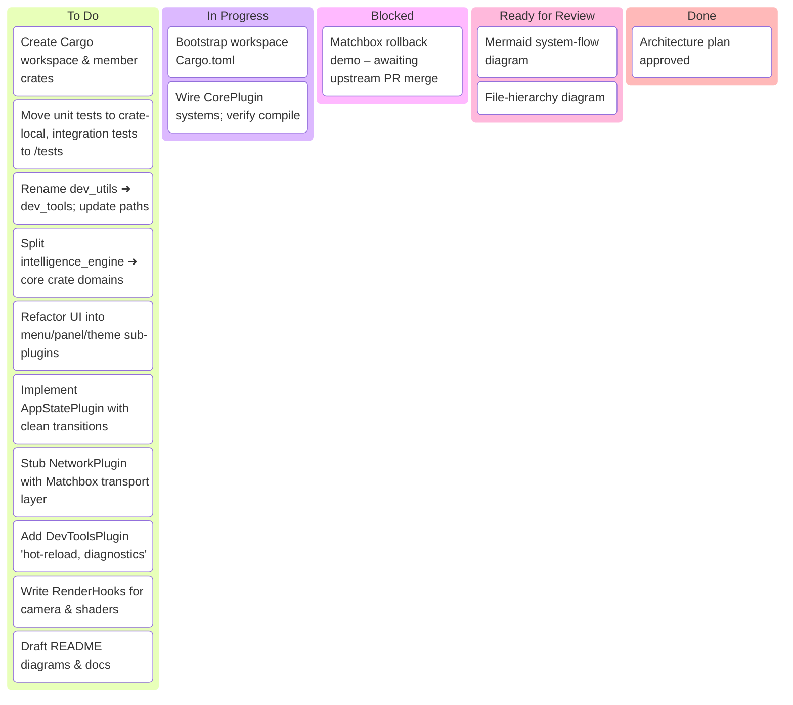

```mermaid
kanban
  todo[To Do]
    tt1[Create Cargo workspace & member crates]
    tt2[Move unit tests to crate-local, integration tests to /tests]
    tt3[Rename dev_utils ➜ dev_tools; update paths]
    tt4[Split intelligence_engine ➜ core crate domains]
    tt5[Refactor UI into menu/panel/theme sub-plugins]
    tt6[Implement AppStatePlugin with clean transitions]
    tt7[Stub NetworkPlugin with Matchbox transport layer]
    tt8[Add DevToolsPlugin 'hot-reload, diagnostics']
    tt9[Write RenderHooks for camera & shaders]
    tt10[Draft README diagrams & docs]

  doing[In Progress]
    tt11[Bootstrap workspace Cargo.toml]
    tt12[Wire CorePlugin systems; verify compile]

  blocked[Blocked]
    tt13[Matchbox rollback demo – awaiting upstream PR merge]

  review[Ready for Review]
    tt14[Mermaid system-flow diagram]
    tt15[File-hierarchy diagram]

  done[Done]
    tt16[Architecture plan approved]

```