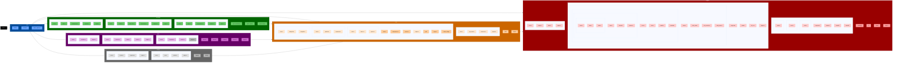

```mermaid
%%{init: {
  "theme":"base",
  "flowchart": { "htmlLabels": false }
}}%%
flowchart LR
    %% ─────────────  TOP-LEVEL  ─────────────
    main[main.rs]

    subgraph APP["app/"]
        direction TB
        app_mod[mod.rs]
        startup[startup.rs]
        plugin_registry[plugin_registry.rs]
    end

    %% ─────────────  CORE  ─────────────
    subgraph CORE["core/"]
        direction TB
        core_state["state/"]
        core_engine["engine/"]

        %% state/
        subgraph core_state_sg[" "]
            direction TB
            state_mod[mod.rs]
            app_state_rs[app_state.rs]
            resources_rs[resources.rs]
            state_plugin_rs[plugin.rs]
        end

        %% engine/
        subgraph core_engine_sg[" "]
            direction TB
            engine_mod[mod.rs]
            components_rs[components.rs]
            events_rs[events.rs]
            engine_plugin_rs[plugin.rs]

            grid["grid/"]
            stepper["stepper/"]
            render_bridge["render_bridge/"]

            %% grid/
            subgraph grid_sg[" "]
                direction TB
                grid_mod[mod.rs]
                dense_rs[dense.rs]
                sparse_rs[sparse.rs]
            end

            %% stepper/
            subgraph stepper_sg[" "]
                direction TB
                stepper_mod[mod.rs]
                parallel_rs[parallel.rs]
                sequential_rs[sequential.rs]
            end

            %% render_bridge/
            subgraph rb_sg[" "]
                direction TB
                rb_mod[mod.rs]
                bridge2d_rs[bridge2d.rs]
                bridge3d_rs[bridge3d.rs]
            end
        end
    end

    %% ─────────────  AUTOMATA  ─────────────
    subgraph AUTOMATA["automata/"]
        direction TB
        type1[type1_elementary/]
        type2[type2_surface/]
        type3[type3_volume/]

        subgraph type1_sg[" "]
            direction TB
            t1_mod[mod.rs]
            rules_rs[rules.rs]
            t1_components_rs[components.rs]
            t1_systems_rs[systems.rs]
            t1_plugin_rs[plugin.rs]
        end
        subgraph type2_sg[" "]
            direction TB
            t2_mod[mod.rs]
            conway_rs[conway.rs]
            dean_life_rs[dean_life.rs]
            t2_components_rs[components.rs]
            t2_systems_rs[systems.rs]
            t2_plugin_rs[plugin.rs]
        end
        subgraph type3_sg[" "]
            direction TB
            t3_mod[mod.rs]
            lenia_rs[lenia.rs]
            t3_components_rs[components.rs]
            t3_systems_rs[systems.rs]
            t3_plugin_rs[plugin.rs]
        end
    end

    %% ─────────────  INPUT  ─────────────
    subgraph INPUT["input/"]
        direction TB
        devices[devices/]
        network[network/]
        scripting[scripting/]
        events_rs_in[events.rs]
        input_plugin_rs[plugin.rs]

        %% devices/
        subgraph devices_sg[" "]
            direction TB
            devices_mod[mod.rs]
            keyboard_rs[keyboard.rs]
            mouse_rs[mouse.rs]
            dev_plugin_rs[plugin.rs]
        end

        %% network/
        subgraph network_sg[" "]
            direction TB
            net_mod[mod.rs]
            protocol_rs[protocol.rs]
            client_rs[client.rs]
            server_rs[server.rs]
            net_plugin_rs[plugin.rs]
        end

        %% scripting/
        subgraph scripting_sg[" "]
            direction TB
            script_mod[mod.rs]
            scenario_rs[scenario.rs]
            script_plugin_rs[plugin.rs]
        end
    end

    %% ─────────────  OUTPUT  ─────────────
    subgraph OUTPUT["output/"]
        direction TB
        rendering[rendering/]
        ui[ui/]
        export[export/]
        rendering_plugin_rs[plugin.rs]

        %% rendering/
        subgraph rendering_sg[" "]
            direction TB
            rend_cargo["cargo.toml"]
            camera["camera/"]
            draw2d["draw2d/"]
            draw3d["draw3d/"]

            subgraph camera_sg[" "]
                direction TB
                cam_mod[mod.rs]
            end
            subgraph draw2d_sg[" "]
                direction TB
                d2_mod[mod.rs]
            end
            subgraph draw3d_sg[" "]
                direction TB
                d3_mod[mod.rs]
            end
        end

        %% ui/
        subgraph ui_sg[" "]
            direction TB
            ui_cargo["cargo.toml"]
            panels[panels/]
            file_io_rs[file_io.rs]
            ui_plugin_rs[plugin.rs]

            subgraph panels_sg[" "]
                direction TB
                panels_mod[mod.rs]
                main_menu[main_menu/]
                sim_controls_rs[sim_controls.rs]
                stats_panel_rs[stats_panel.rs]

                subgraph main_menu_sg[" "]
                    direction TB
                    mm_mod[mod.rs]
                    view_rs[view.rs]
                    model_rs[model.rs]
                    controller[controller/]

                    subgraph controller_sg[" "]
                        direction TB
                        ctrl_mod[mod.rs]
                        scenario[scenario/]
                        options_rs[options.rs]

                        subgraph scenario_sg[" "]
                            direction TB
                            scenario_mod[mod.rs]
                            new_rs[new.rs]
                            load_rs[load.rs]
                        end
                    end
                end
            end
        end

        %% export/
        subgraph export_sg[" "]
            direction TB
            exp_mod[mod.rs]
            image_rs[image.rs]
            data_rs[data.rs]
            exp_plugin_rs[plugin.rs]
        end
    end

    %% ─────────────  DEV TOOLS  ─────────────
    subgraph DEVTOOLS["tooling/"]
        direction TB
        logging[logging/]
        debug[debug/]
        dev_plugin_rs[plugin.rs]

        subgraph logging_sg[" "]
            direction TB
            log_mod[mod.rs]
            fps_rs[fps.rs]
            profiler_rs[profiler.rs]
            log_plugin_rs[plugin.rs]
        end

        subgraph debug_sg[" "]
            direction TB
            dbg_mod[mod.rs]
            cheats_rs[cheats.rs]
            inspector_rs[inspector.rs]
            dbg_plugin_rs[plugin.rs]
        end
    end

    %% ─────────────  CONNECTIONS  ─────────────
    main --> APP
    APP  --> CORE & AUTOMATA & INPUT & OUTPUT & DEVTOOLS
    AUTOMATA --> CORE
    INPUT     --> CORE
    DEVTOOLS  --> CORE
    CORE      --> OUTPUT

    %% ─────────────  COLOURS  ─────────────
    classDef c_main        fill:#000000,stroke:#000000,color:#ffffff,stroke-width:2px

    classDef c_app_root    fill:#004C99,stroke:#00264d,color:#ffffff
    classDef c_app_child   fill:#66A3FF,stroke:#004C99,color:#000000
    classDef c_app_leaf    fill:#B3D1FF,stroke:#66A3FF,color:#000000

    classDef c_core_root   fill:#CC6600,stroke:#663300,color:#ffffff
    classDef c_core_child  fill:#FFCC99,stroke:#CC6600,color:#000000
    classDef c_core_leaf   fill:#FFE6CC,stroke:#FFCC99,color:#000000

    classDef c_aut_root    fill:#006600,stroke:#003300,color:#ffffff
    classDef c_aut_child   fill:#66CC66,stroke:#006600,color:#000000
    classDef c_aut_leaf    fill:#BFF0BF,stroke:#66CC66,color:#000000

    classDef c_inp_root    fill:#660066,stroke:#330033,color:#ffffff
    classDef c_inp_child   fill:#CC66CC,stroke:#660066,color:#000000
    classDef c_inp_leaf    fill:#E8B3E8,stroke:#CC66CC,color:#000000

    classDef c_out_root    fill:#990000,stroke:#4d0000,color:#ffffff
    classDef c_out_child   fill:#FF9999,stroke:#990000,color:#000000
    classDef c_out_leaf    fill:#FFCACA,stroke:#FF9999,color:#000000

    classDef c_dev_root    fill:#666666,stroke:#333333,color:#ffffff
    classDef c_dev_child   fill:#B3B3B3,stroke:#666666,color:#000000
    classDef c_dev_leaf    fill:#E0E0E0,stroke:#B3B3B3,color:#000000

    %% ───── assign classes (roots, children, leaves) ─────
    class main c_main

    class APP c_app_root
    class app_mod,startup,plugin_registry c_app_child

    class CORE c_core_root
    class core_state,core_engine,engine_mod,components_rs,events_rs,grid,stepper,render_bridge c_core_child
    class state_mod,app_state_rs,resources_rs,state_plugin_rs,grid_mod,dense_rs,sparse_rs,stepper_mod,parallel_rs,sequential_rs,rb_mod,bridge2d_rs,bridge3d_rs,engine_plugin_rs c_core_leaf

    class AUTOMATA c_aut_root
    class type1,type2,type3,t1_mod,rules_rs,t1_components_rs,t1_systems_rs,t1_plugin_rs,t2_mod,conway_rs,dean_life_rs,t2_components_rs,t2_systems_rs,t2_plugin_rs,t3_mod,lenia_rs,t3_components_rs,t3_systems_rs,t3_plugin_rs c_aut_child

    class INPUT c_inp_root
    class devices,network,scripting,events_rs_in,input_plugin_rs c_inp_child
    class devices_mod,keyboard_rs,mouse_rs,dev_plugin_rs,net_mod,protocol_rs,client_rs,server_rs,net_plugin_rs,script_mod,scenario_rs,script_plugin_rs c_inp_leaf

    class OUTPUT c_out_root
    class rendering,ui,export,rendering_plugin_rs c_out_child
    class rend_cargo,camera,draw2d,draw3d,cam_mod,d2_mod,d3_mod,ui_cargo,panels,file_io_rs,ui_plugin_rs,panels_mod,main_menu,sim_controls_rs,stats_panel_rs,mm_mod,view_rs,model_rs,controller,ctrl_mod,scenario,options_rs,scenario_mod,new_rs,load_rs,exp_mod,image_rs,data_rs,exp_plugin_rs c_out_leaf

    class DEVTOOLS c_dev_root
    class logging,debug,dev_plugin_rs c_dev_child
    class log_mod,fps_rs,profiler_rs,log_plugin_rs,dbg_mod,cheats_rs,inspector_rs,dbg_plugin_rs c_dev_leaf

    %% ─────────────  TOOL-TIPS  ─────────────
    click core_state "#" "Global state resources & AppState enum"
    click core_engine "#" "Engine – grid backend, stepping & render bridges"
    click engine_plugin_rs "#" "EnginePlugin – registers core systems & rule plugins"
    click components_rs "#" "Core ECS components (Cell, Grid, …)"
    click state_plugin_rs "#" "StatePlugin – inserts Settings & Session"
    click grid "#" "Grid back-ends (dense vs sparse)"
    click stepper "#" "Sequential / parallel stepping"
    click render_bridge "#" "Bridge: simulation → rendering"
```